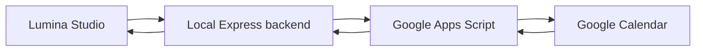
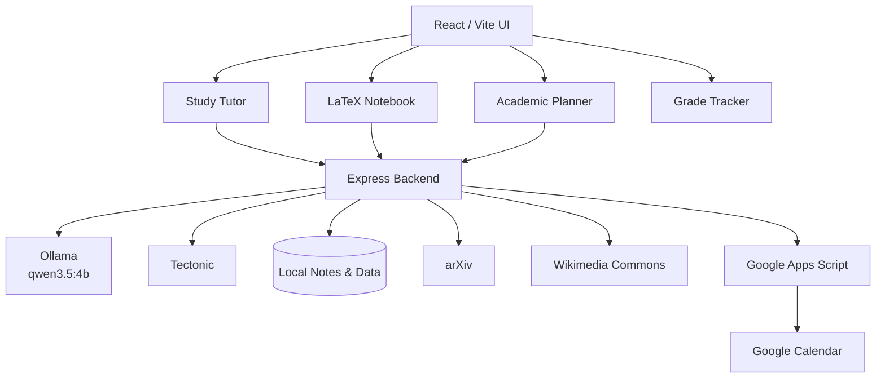

<div align="center">

# ✦ Lumina Studio

### Local-first AI workspace for Engineering Physics

**Study · Solve · Write · Organize · Research**

[](https://github.com/PauMonterosa/Lumina-Studio)
[](https://react.dev/)
[](https://vite.dev/)
[](https://tailwindcss.com/)
[](https://nodejs.org/)
[](https://ollama.com/)
[](https://tectonic-typesetting.github.io/)
[](https://calendar.google.com/)
[](https://arxiv.org/)

**Lumina Studio** is a personal, local-first academic environment built to support a demanding university STEM workflow — with a particular focus on **Engineering Physics**.

Instead of separating AI chat, LaTeX notes, exams, planning, grades, scientific figures and research into different tools, Lumina brings them into a single workspace while keeping the core AI and academic data on the local machine.

</div>

---

## Why Lumina?

Most AI study tools are excellent at one task and disconnected from everything else.

Lumina is designed around a different idea:

> **Your AI tutor should understand the subject you are studying, the notes you are writing, the date you are working on and the academic context around it.**

The result is not just a chatbot. Lumina acts as a small academic operating system for the semester.

---

## Core workspace

| Workspace | What it does |
|---|---|
| 🧠 **Study** | Contextual local AI tutor with conceptual, problem-solving and exam modes |
| 📝 **Notes** | Daily LaTeX notebook with live Tectonic compilation and PDF preview |
| 📅 **Agenda** | Events, tasks, exams, deadlines, priorities and Google Calendar sync |
| 📊 **Grades** | Continuous-assessment tracking and course-grade planning |
| 🔬 **Scientific figures** | Search and import figures from scientific/open sources |
| 🎙️ **Class diary** | Date-aware voice/transcription notes linked to subjects |

---

# 🧠 Local AI tutor

Lumina uses **Ollama** as its local inference runtime.

The default model is currently:

```text
qwen3.5:4b
```

The tutor is subject-aware and can combine:

- active subject,
- selected study mode,
- selected date,
- current conversation,
- saved class diary entries,
- LaTeX notes,
- local academic context.

### Study modes

| Mode | Behaviour |
|---|---|
| **Conceptual** | Prioritises intuition, physical meaning and clear explanations |
| **Problems** | Works through calculations and derivations step by step |
| **Exam** | Produces stricter, evaluable, exam-style solutions |

The core academic workflow does **not require a cloud LLM API**.

---

# 📝 LaTeX notebook

Lumina includes a real daily LaTeX notebook rather than a plain-text notes editor.

Notes are stored by:

```text
subject / date
```

Example:

```text
notes/
└── daily/
    └── quantum/
        └── 2026-09-18.tex
```

### Notebook capabilities

- real `.tex` source files,
- automatic saving,
- fast recompilation,
- PDF preview,
- Tectonic-based rendering,
- automatic package detection,
- mathematical environments,
- figures,
- tables,
- equations,
- TikZ-compatible documents,
- local LaTeX autocomplete.

### Local autocomplete

Autocomplete is deterministic and runs without loading an AI model.

It supports common LaTeX structures such as:

```latex
\begin{align}
...
\end{align}
```

```latex
\frac{}{}
```

```latex
\left( \right)
```

and arbitrary environment completion.

`Tab` accepts the suggestion and `Esc` dismisses it.

---

# ✨ Manual AI actions inside the editor

For situations where local autocomplete is not enough, the notebook can explicitly call the local Qwen model.

Current actions include:

- **Complete**
- **Improve**
- **Equation**

These actions generate a proposal instead of silently rewriting the note, so the student remains in control of the final LaTeX source.

---

# 🔬 Scientific figure search

Technical notes often need a real band diagram, diffraction setup, device cross-section or scientific illustration — not an AI-generated decorative image.

Lumina therefore includes a dedicated scientific figure workflow.

### Current sources

- **arXiv** — figures extracted from scientific papers when available
- **Wikimedia Commons** — openly licensed scientific and technical media

Example searches:

```text
MOSFET energy band diagram
Young double slit interference
diffraction grating
PN junction band diagram
stress strain curve
```

A selected figure can be downloaded into the project and inserted directly into the LaTeX note with its source information preserved.

> arXiv figure reuse depends on the licence of the original paper. Always check the source before republishing material.

---

# 📅 Academic agenda

Lumina includes a full academic planner rather than a minimal calendar.

Events support:

- title,
- subject,
- date,
- start and end time,
- location,
- description,
- event type,
- priority,
- completion state.

### Event types

```text
Class · Study · Task · Assignment · Exam · Personal · Event
```

### Priority system

Priority is visually separated from the subject colour:

- 🔴 **High**
- 🟡 **Normal**
- ⚪ **Low**

This keeps the calendar readable while still preserving the identity of each subject.

### Productivity actions

Events can be:

- edited,
- duplicated,
- completed,
- deleted,
- restored with **Undo**.

A **Upcoming** panel automatically surfaces the next relevant academic commitments.

---

# 📆 Google Calendar integration

Lumina can synchronise the visible month with Google Calendar.

The integration uses a lightweight **Google Apps Script bridge**, avoiding the need to run a hosted backend or expose the local application publicly.



### Sync behaviour

**Lumina → Google**

- create new Lumina events in Google,
- update previously linked Lumina events.

**Google → Lumina**

- import Google Calendar events,
- preserve Google as the authoritative source for Google-originated events.

Sensitive bridge configuration is stored locally and excluded from Git.

---

# 📊 Grade tracker

The **Grades** workspace is designed for continuous assessment.

It can be used to organise:

- assessment items,
- weights,
- obtained marks,
- remaining evaluation,
- target final grades.

The goal is to answer practical questions such as:

> *What grade do I need on the final exam to finish the subject with an 8?*

---

# 🎙️ Class diary and transcription

Lumina can associate class notes and transcriptions with:

- a subject,
- a calendar date,
- a language,
- the surrounding academic context.

Supported speech-language profiles currently include:

| Language | Code |
|---|---|
| Català | `ca-ES` |
| Castellano | `es-ES` |
| English | `en-US` |

Diary entries can later become part of the tutor context or be converted into structured study material.

---

# 🧩 Study tools

Lumina can generate academic material from the current subject context.

| Tool | Purpose |
|---|---|
| 🧠 **Mind map** | Structured conceptual overview |
| 🎧 **Podcast script** | Explanatory study narrative |
| 🗂️ **Flashcards** | Active-recall questions |
| 📝 **Practice exam** | Exam-style questions and solutions |

These tools are intended to transform existing course material rather than generate disconnected generic content.

---

# 🎓 Engineering Physics configuration

Lumina is currently configured around five technical subjects:

| Subject | ID |
|---|---|
| Electrónica Física | `electronics` |
| Mecánica Cuántica | `quantum` |
| Teoría de Control | `control` |
| Fotónica | `photonics` |
| Estado Sólido | `solid_state` |

The architecture is intentionally extensible: subjects are configuration, not separate applications.

---

# 🏗️ Architecture



### Design principle

```text
Local by default
Cloud only when the feature inherently requires it
```

---

# 🔐 Privacy model

Not every Lumina feature has the same network requirements.

| Feature | Local | Internet |
|---|:---:|:---:|
| Ollama tutor | ✅ | — |
| LaTeX notes | ✅ | — |
| Tectonic compilation | ✅ | normally not after dependencies are cached |
| Agenda | ✅ | — |
| Grades | ✅ | — |
| Scientific figure search | — | ✅ |
| Google Calendar sync | — | ✅ |
| Future academic research connectors | — | ✅ |

Private notes, model prompts and academic files do not need to be sent to a commercial LLM service for the core workflow.

> Never commit secrets, private transcripts or personal calendar configuration to Git.

---

# 🧱 Project structure

The active project is organised around small frontend workspaces and modular backend routes.

```text
Lumina-Studio/
│
├── src/
│   ├── App.jsx
│   ├── index.css
│   └── components/
│       ├── AcademicPlanner.jsx
│       ├── ChatAsignatura.jsx
│       ├── GradeTracker.jsx
│       ├── LatexNotebook.jsx
│       ├── MessageContent.jsx
│       ├── NotesCalendarDiary.jsx
│       ├── StudyActionsPanel.jsx
│       ├── StudyResultModal.jsx
│       ├── TranscriptionPanel.jsx
│       └── VisualizadorAudio.jsx
│
├── server/
│   ├── notesServer.js
│   ├── notebookRoutes.js
│   ├── notebookAiRoutes.js
│   ├── notebookFigureRoutes.js
│   └── googleCalendarBridgeRoutes.js
│
├── notes/
│   ├── daily/
│   └── media/
│
├── tectonic.exe
├── package.json
└── README.md
```

Some local integration files are intentionally excluded from Git.

---

# ⚙️ Technology stack

<div align="center">

| Layer | Technology |
|---|---|
| Frontend | React 19 · Vite 8 · Tailwind CSS 4 |
| UI | Lucide React |
| Math rendering | KaTeX · remark-math · rehype-katex |
| Backend | Node.js · Express |
| Local AI | Ollama · Qwen |
| Typesetting | LaTeX · Tectonic |
| Scientific search | arXiv · Wikimedia Commons |
| Calendar | Google Calendar · Apps Script |
| Persistence | Local filesystem · localStorage |

</div>

---

# 🚀 Local setup

## Requirements

Install:

- Node.js
- npm
- Ollama
- Tectonic

Pull the local model:

```powershell
ollama pull qwen3.5:4b
```

Clone the repository:

```powershell
git clone https://github.com/PauMonterosa/Lumina-Studio.git
cd Lumina-Studio
```

Install dependencies:

```powershell
npm.cmd install
```

Start the backend:

```powershell
npm.cmd run notes
```

Start the frontend in a second terminal:

```powershell
npm.cmd run dev
```

Typical development URLs:

```text
Frontend  http://localhost:5173
Backend   http://localhost:3001
```

### Why `npm.cmd`?

On Windows PowerShell, script execution policies can block `npm.ps1`. Calling `npm.cmd` avoids that PowerShell-specific issue.

---

# 🧪 Development checks

Before considering a change stable:

```powershell
npm.cmd run build
```

Backend files can be checked independently:

```powershell
node --check .\server\notesServer.js
node --check .\server\notebookRoutes.js
node --check .\server\notebookAiRoutes.js
node --check .\server\notebookFigureRoutes.js
node --check .\server\googleCalendarBridgeRoutes.js
```

---

# 🔭 Research mode — recommended next extension

Lumina already covers most of the daily study loop.

The next major extension is not another chat mode: it is a **citation-grounded research workflow**.

A future **Research** workspace could combine:

```text
Question
   ↓
Academic search
   ↓
Paper shortlist
   ↓
Evidence extraction
   ↓
Cited synthesis
   ↓
BibTeX / LaTeX
```

Useful providers include:

- Consensus
- arXiv
- OpenAlex
- Crossref
- Semantic Scholar

Consensus is particularly interesting as an **optional** connector for literature reviews and project reports because it provides academically grounded search and structured research filters. It should remain separate from the everyday local tutor so that ordinary course questions do not consume external API calls.

---

# 🗺️ Roadmap

### High-value next steps

- [ ] PDF / textbook ingestion with semantic retrieval
- [ ] Vector search across all personal notes
- [ ] Python scientific-computing tool
- [ ] SymPy symbolic mathematics
- [ ] NumPy / SciPy numerical workflows
- [ ] Matplotlib plots generated from course problems or laboratory data
- [ ] Citation-grounded **Research mode**
- [ ] BibTeX / DOI library
- [ ] Exam and exercise repository by subject
- [ ] Spaced-repetition scheduling
- [ ] Automatic encrypted backup/export

### Optional integrations

- [ ] Consensus API
- [ ] Zotero
- [ ] GitHub-backed note snapshots
- [ ] Mobile/PWA workflow

---

# 🧠 Project philosophy

Lumina is not intended to replace lectures, textbooks or mathematical reasoning.

It is designed to reduce the friction between them.

A productive Engineering Physics workflow often looks like:

```text
Lecture
  ↓
Daily LaTeX notes
  ↓
Ask conceptual questions
  ↓
Solve exercises
  ↓
Organise deadlines
  ↓
Track grades
  ↓
Find scientific sources
  ↓
Prepare the exam or report
```

Lumina tries to keep that entire loop in one coherent environment.

---

# ⚠️ Academic use

AI-generated technical material can contain mistakes.

For graded work, laboratory reports and scientific writing:

- verify equations,
- check units,
- inspect primary sources,
- validate citations,
- compare important claims against course material or peer-reviewed literature.

Lumina is a study and research assistant, not an authority.

---

# 👤 Author

Developed by **Pau Monterosa**.

Built as a personal local-first academic workspace for **Engineering Physics**.

<div align="center">

---

**Lumina Studio**

*One workspace for the technical semester.*

[Repository](https://github.com/PauMonterosa/Lumina-Studio)

</div>
